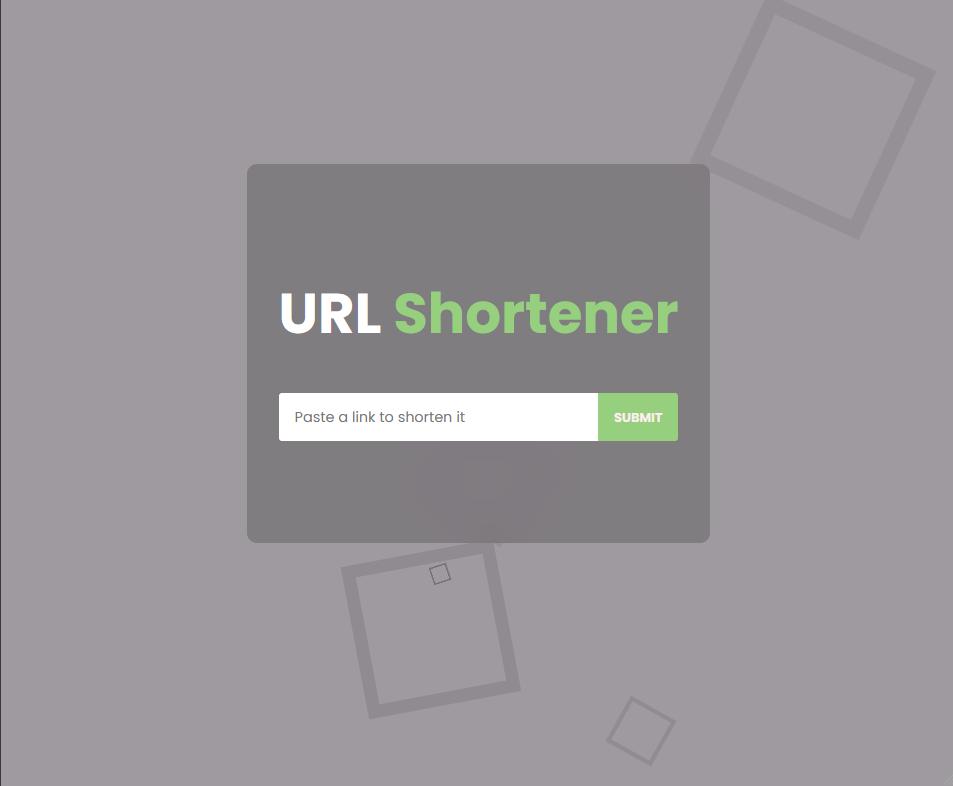

# URL Shortener

## Description

Simple URL shortener with responsive design and with the help of shrtco.de API to create a shortened link.

## Features

- Paste any link you want to shorten.
- Copy the Shortened link.
- Responsive Design.

## Technologies Used

- React
- CSS 3
